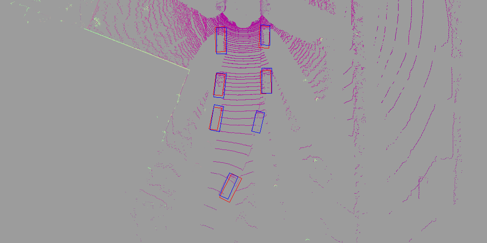

# Complex-YOLO
Complex-YOLO: Real-time 3D Object Detection on Point Clouds   pytorch

# Introduction
This is an unofficial implementation of Complex-YOLO: Real-time 3D Object Detection on Point Clouds in pytorch. A large part of this project is based on the work here:https://github.com/marvis/pytorch-yolo2
Point Cloud Preprocessing is based on:https://github.com/skyhehe123/VoxelNet-pytorch
                                      https://github.com/dongwoohhh/MV3D-Pytorch

# Data Preparation
Download the 3D KITTI detection dataset.
Camera calibration matrices of object data set (16 MB)
Training labels of object data set (5 MB)
Velodyne point clouds (29 GB)

# Train
python3 main.py

# Special
Correct the bbox direction problem based on the project [https://github.com/AI-liu/Complex-YOLO](https://github.com/AI-liu/Complex-YOLO)

# Result

